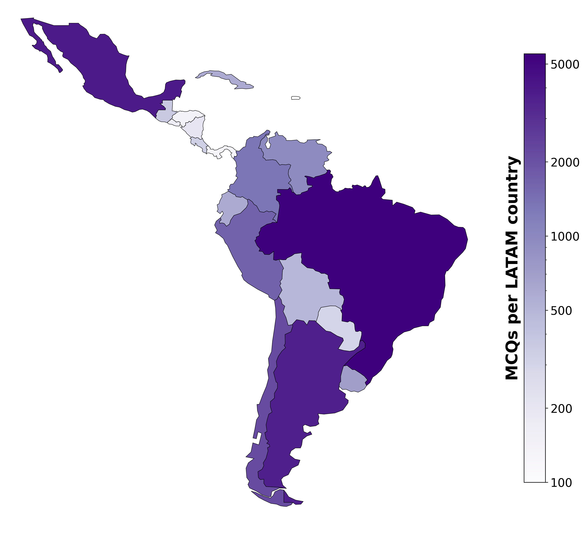

# LatamQA 

<!--
Source - https://stackoverflow.com/a/38274615
Posted by user3638471, modified by community. See post 'Timeline' for change history
Retrieved 2026-02-11, License - CC BY-SA 4.0
-->




[LatamQA](https://users.dcc.uchile.cl/~vbarrier/paper/MME_ACL_SC_Biases.pdf) is a cultural knowledge benchmark designed to evaluate Large Language Models on Latin American contexts. The dataset addresses the critical gap in bias detection resources for non-English languages and underrepresented cultures. Built from 26,000+ Wikipedia articles and structured using Wikidata's knowledge graph with expert guidance from social scientists, LatamQA contains over 26,000 multiple-choice questions covering the diverse popular and social cultures of Latin American countries. Questions are available in Spanish and Portuguese (the region's primary languages) as well as English translations, enabling evaluation of both multilingual capabilities and cultural representation. This resource helps researchers assess whether LLMs—predominantly trained on Global North data—exhibit prejudicial behavior or knowledge gaps when handling Latin American cultural contexts.

## Composition

* MCQ in Latam Spanish, Iberian Spanish, Brasilian Portuguese. Every file has the English version
* Metadata and content of the Wikipedia articles

## LatamQA datasets

We have made available datasets and matching metadata as the Hugging Face `dataset` collection: <https://huggingface.co/collections/inria-chile/latamqa>.

| Latam Spanish MCQ dataset | [`inria-chile/latamqa_mcq_es-la`](https://huggingface.co/datasets/inria-chile/latamqa_mcq_es-la) |
| :--- | :--- |
| Latam Spanish metadata | [`inria-chile/latamqa_articles_es-la`](https://huggingface.co/datasets/inria-chile/latamqa_articles_es-la) |
| Iberian Spanish MCQ dataset | [`inria-chile/latamqa_mcq_es-es`](https://huggingface.co/datasets/inria-chile/latamqa_mcq_es-es) |
| Iberian Spanish metadata | [`inria-chile/latamqa_articles_es-es`](https://huggingface.co/datasets/inria-chile/latamqa_articles_es-es) |
| Brazilian Portuguese MCQ dataset | [`inria-chile/latamqa_mcq_pt-br`](https://huggingface.co/datasets/inria-chile/latamqa_mcq_pt-br) |
| Brazilian Portuguese metadata | [`inria-chile/latamqa_articles_pt-br`](https://huggingface.co/datasets/inria-chile/latamqa_articles_pt-br) |

Usage example:

```python
from datasets import load_dataset

dataset = load_dataset("inria-chile/latamqa_mcq_es-la")
dataset_as_df = dataset["train"].to_pandas()
```

## `eval_mcq` Evaluation script

[`latamqa/eval_mcq.py`](latamqa/eval_mcq.py) evaluates a model on the LatamQA MCQ benchmark via OpenAI-compatible or Mistral APIs.

### Requirements

1. Install the `uv` dependencies handling tool <https://docs.astral.sh/uv/getting-started/installation/>. For instance, by running:

  ```bash
  curl -LsSf https://astral.sh/uv/install.sh | sh
  ```

2. In the `LatamQA` directory, install project dependencies by running `uv sync`. This will create a Python virtual environment in the folder `.venv/`.
3. Setup `API_LLM` and `URL_LLM` environment variables:

```bash
export API_LLM="your-api-key"
export URL_LLM="https://your-api-endpoint"  # OpenAI-compatible base URL
```

### Usage

```bash
uv run eval_mcq --model MODEL [--provider {openai,mistral}] [--region {es-la,es-es,pt-br}] [--lang {o,en}] [--limit LIMIT] [--seed SEED] [--temperature TEMPERATURE] [--prompt_template PROMPT_TEMPLATE]
```

| Argument  | Default | Description |
|-----------|---------|-------------|
| `--model` | (required) | Model name to evaluate |
| `--provider` | `openai` | `openai` or `mistral` |
| `--region` | `es-la` | `es-la`, `es-es`, or `pt-br` |
| `--lang` | `o` | `o` (original language) or `en` (English) |
| `--limit` | None | Limit number of questions evaluated |
| `--seed` | `42` | Seed for answer option shuffling |
| `--temperature` | `0.0` | Sampling temperature |
| `--prompt_template` | None | File name of custom prompt template |

**Note:** `eval_mcq.py` can also be run by activating the Python virtual environment and running the script directly, for instance:

```bash
source .venv/bin/activate
python latamqa/eval_mcq.py --model <your-model>
```

### Examples

```bash
# Evaluate on Latam Spanish (default)
uv run eval_mcq --model meta-llama/Llama-3.1-8B-Instruct

# Evaluate on Brazilian Portuguese, english questions, first 100 items
uv run eval_mcq --model meta-llama/Llama-3.1-8B-Instruct --region pt-br --lang en --limit 100

# Evaluate with Mistral provider
uv run eval_mcq --model mistral-large-latest --provider mistral --region es-es
```

### Custom prompt template

If you want to use a custom evaluation prompt you can pass the file name as argument to `eval_mcq.py`. File `prompt_eval.txt` contains an example of prompt.

### Output

Results are saved in the `results/` directory:

* `mcq_eval_results_<region>_<lang>_<model>.csv` -- per-question details
* `mcq_eval_summary_<region>_<lang>_<model>.txt` -- accuracy summary

## Citation

If this work was useful please cite the following:

```bibtex
@inproceedings{karmimleveraging2026,
  title={Leveraging Wikidata for Geographically Informed Sociocultural Bias Dataset Creation: Application to Latin America},
  author={Karmim, Yannis and Pino, Renato and Contreras, Hernan and Lira, Hernan and Cifuentes, Sebastien and Escoffier, Simon and Marti, Luis and Seddah, Djamé and Barriere, Valentin},
  booktitle={Proceedings of the 1sh Workshop on Multilingual Multicultural Evaluation @ EACL26},
  url={https://users.dcc.uchile.cl/~vbarrier/paper/MME_ACL_SC_Biases.pdf},
  year={2026}
}
```

