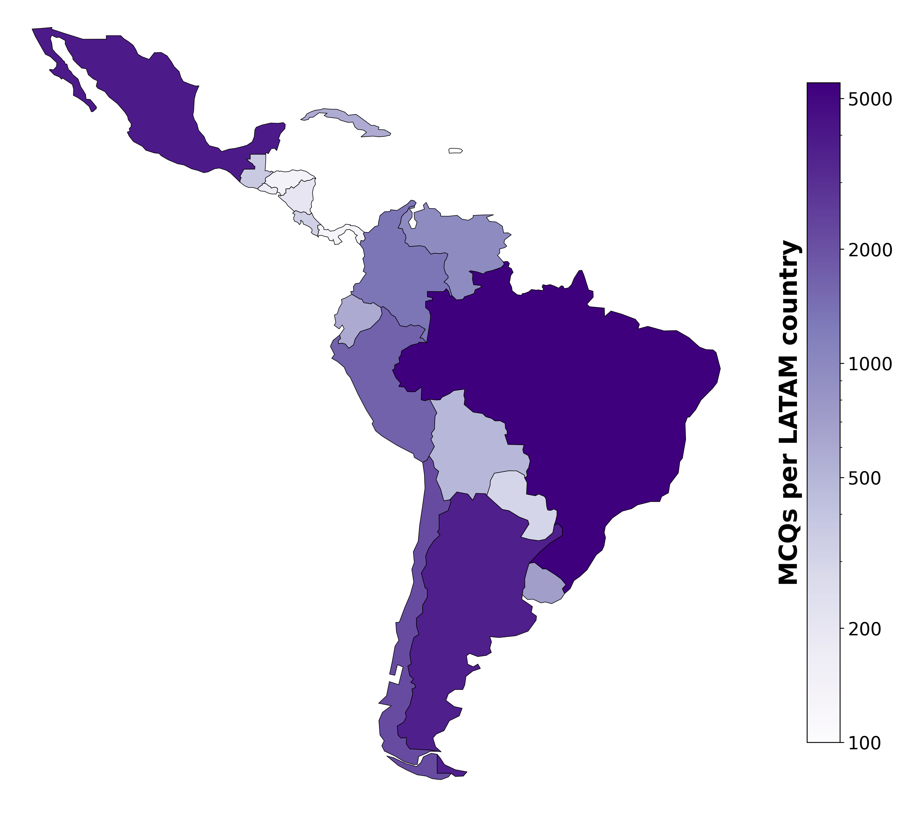
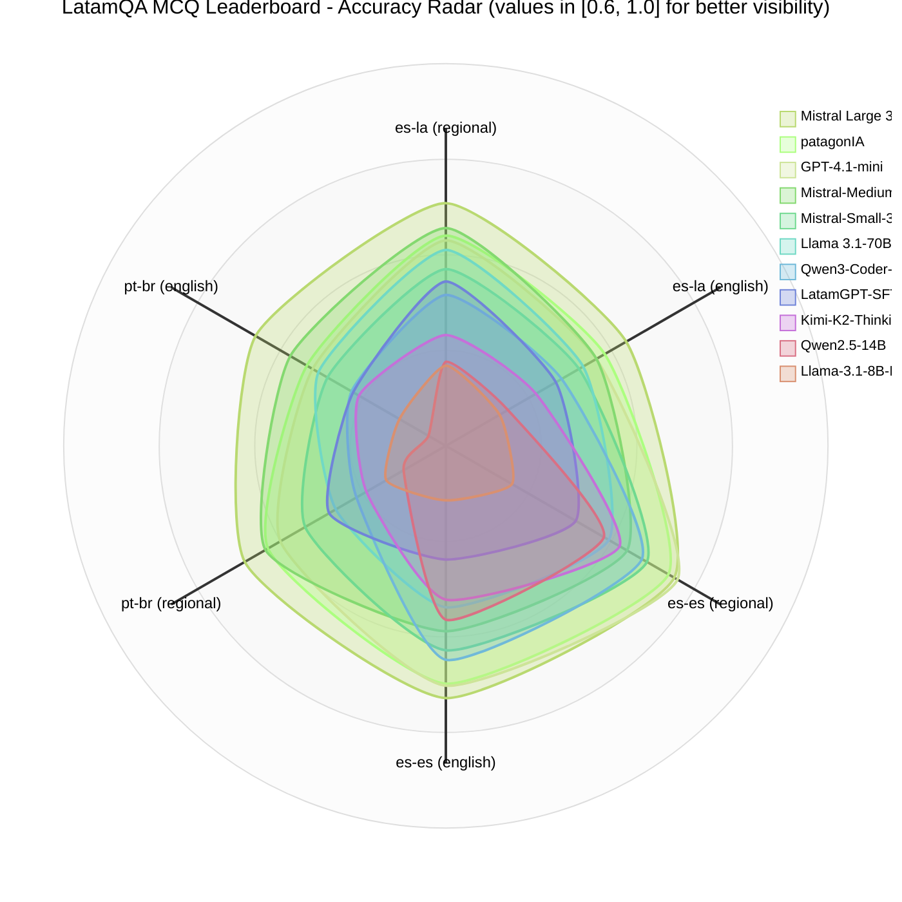

# `LatamQA`: Leveraging Wikidata for Geographically Informed Sociocultural Bias Dataset Creation: Application to Latin America

<table><tr><td width="74%">
<a href="https://users.dcc.uchile.cl/~vbarrier/paper/MME_ACL_SC_Biases.pdf">LatamQA</a> is a cultural knowledge benchmark designed to evaluate Large Language Models on Latin American contexts. The dataset addresses the critical gap in bias detection resources for non-English languages and underrepresented cultures. Built from 26,000+ Wikipedia articles and structured using Wikidata's knowledge graph with expert guidance from social scientists, LatamQA contains over 26,000 multiple-choice questions covering the diverse popular and social cultures of Latin American countries. Questions are available in Spanish and Portuguese (the region's primary languages) as well as English translations, enabling evaluation of both multilingual capabilities and cultural representation. This resource helps researchers assess whether LLMs—predominantly trained on Global North data—exhibit prejudicial behavior or knowledge gaps when handling Latin American cultural contexts.</td><td width="26%"></td></tr></table>

## Dataset composition

* MCQ in Latam Spanish, Iberian Spanish, Brazilian Portuguese. Every file has the English version.
* Metadata and content of the Wikipedia articles.

### Online `LatamQA` datasets

We have made available datasets and matching metadata as the Hugging Face `dataset` collection: <https://huggingface.co/collections/inria-chile/latamqa>.

| Dataset name | HF hub identifier |
| :--- | :--- |
| Latam Spanish MCQ dataset | [`inria-chile/latamqa_mcq_es-la`](https://huggingface.co/datasets/inria-chile/latamqa_mcq_es-la) |
| Latam Spanish metadata | [`inria-chile/latamqa_articles_es-la`](https://huggingface.co/datasets/inria-chile/latamqa_articles_es-la) |
| Iberian Spanish MCQ dataset | [`inria-chile/latamqa_mcq_es-es`](https://huggingface.co/datasets/inria-chile/latamqa_mcq_es-es) |
| Iberian Spanish metadata | [`inria-chile/latamqa_articles_es-es`](https://huggingface.co/datasets/inria-chile/latamqa_articles_es-es) |
| Brazilian Portuguese MCQ dataset | [`inria-chile/latamqa_mcq_pt-br`](https://huggingface.co/datasets/inria-chile/latamqa_mcq_pt-br) |
| Brazilian Portuguese metadata | [`inria-chile/latamqa_articles_pt-br`](https://huggingface.co/datasets/inria-chile/latamqa_articles_pt-br) |

Usage example:

```python
from datasets import load_dataset

dataset = load_dataset("inria-chile/latamqa_mcq_es-la")
dataset_as_df = dataset["train"].to_pandas()
```

## Leaderboard

<span name="leaderboard">

| Model name                                                                                             | Ref.                                                                      | Size   | # params   | Comments         | Average    | es-la (regional)   | es-la (english)   | es-es (regional)   | es-es (english)   | pt-br (regional)   | pt-br (english)   |
|:-------------------------------------------------------------------------------------------------------|:--------------------------------------------------------------------------|:-------|:-----------|:-----------------|:-----------|:-------------------|:------------------|:-------------------|:------------------|:-------------------|:------------------|
| [Mistral-Small-3.1-24B-Instruct](https://huggingface.co/mistralai/Mistral-Small-3.1-24B-Instruct-2503) | [🔗](https://arxiv.org/abs/2601.08584)                                    | small  | 24B        |                  | 0.7860     | 0.7850             | 0.7610            | 0.8430             | 0.8140            | 0.7700             | 0.7430            |
| [Llama-3.1-8B-Instruct](https://huggingface.co/meta-llama/Llama-3.1-8B-Instruct)                       | [🔗](https://ai.meta.com/blog/meta-llama-3-1/)                            | small  | 8B         |                  | 0.6690     | 0.6840             | 0.6650            | 0.6800             | 0.6570            | 0.6720             | 0.6560            |
| [Qwen2.5-14B](https://huggingface.co/Qwen/Qwen2.5-14B-Instruct)                                        | [🔗](https://arxiv.org/abs/2407.10671)                                    | medium | 14B        |                  | 0.7013     | 0.6880             | 0.6750            | 0.7910             | 0.7820            | 0.6510             | 0.6210            |
| [GPT-4.1-mini](https://developers.openai.com/api/docs/models/gpt-4.1-mini)                             | [🔗](https://openai.com/index/gpt-4-1/)                                   | medium | ??         |                  | 0.8148     | 0.8150             | 0.7820            | **0.8800**         | 0.8510            | 0.8000             | 0.7610            |
| [Mistral-Medium-3.5-128B](https://huggingface.co/mistralai/Mistral-Medium-3.5-128B)                    | [🔗](https://docs.mistral.ai/models/model-cards/mistral-medium-3-5-26-04) | medium | 128B       |                  | 0.8048     | 0.8280             | 0.7820            | 0.8190             | 0.7940            | 0.8180             | 0.7880            |
| [LatamGPT-SFT-1.0](https://huggingface.co/latam-gpt/Llama-3.1-70B-LatamGPT-SFT-1.0)                    | [🔗](https://www.latamgpt.org)                                            | medium | 70B        | Focused on Latam | 0.7390     | 0.7720             | 0.7330            | 0.7570             | 0.7190            | 0.7410             | 0.7120            |
| [Llama 3.1-70B-Instruct](https://huggingface.co/meta-llama/Llama-3.1-70B-Instruct)                     | [🔗](https://ai.meta.com/blog/meta-llama-3-1/)                            | medium | 70B        |                  | 0.7707     | 0.8050             | 0.7660            | 0.7970             | 0.7690            | 0.7330             | 0.7540            |
| [Qwen3-Coder-480B-A35B-Instruct](https://huggingface.co/Qwen/Qwen3-Coder-480B-A35B-Instruct)           | [🔗](https://arxiv.org/abs/2505.09388)                                    | large  | 430B       |                  | 0.7635     | 0.7580             | 0.7400            | 0.8370             | 0.8240            | 0.7080             | 0.7140            |
| [Kimi-K2-Thinking](https://huggingface.co/moonshotai/Kimi-K2-Thinking)                                 | [🔗](https://moonshotai.github.io/Kimi-K2/thinking.html)                  | large  | 1T         |                  | 0.7328     | 0.7160             | 0.7090            | 0.8100             | 0.7610            | 0.6960             | 0.7050            |
| [Mistral Large 3](https://huggingface.co/mistralai/Mistral-Large-3-675B-Instruct-2512)                 | [🔗](https://docs.mistral.ai/models/mistral-large-3-25-12)                | large  | 675B       |                  | **0.8475** | **0.8540**         | **0.8180**        | 0.8760             | **0.8640**        | **0.8430**         | **0.8300**        |
| [patagonIA](https://patagoniaia.cl)                                                                    | [🔗](https://patagoniaia.cl/)                                             | ??     | ??         | Focused on Chile | 0.8188     | 0.8200             | 0.7920            | 0.8690             | 0.8490            | 0.8150             | 0.7680            |

</span>

<span name="radar">



```mermaid
---
title: LatamQA MCQ Leaderboard - Accuracy Radar (values in [0.6, 1.0] for better visibility)
config:
  width: 600
  height: 600
  theme: forest
  themeVariables:
    radar:
      curveOpacity: 0.29
      graticuleOpacity: 0.11
      legendBoxSize: 150
      legendFontSize: 11
  radar:
      axisScaleFactor: 0.83
      axisLabelFactor: 0.83
      axisLabelFontSize: 11pt
      curveTension: 0.092
---
radar-beta
  axis a0["es-la (regional)"], a1["es-la (english)"], a2["es-es (regional)"], a3["es-es (english)"], a4["pt-br (regional)"], a5["pt-br (english)"]
  curve c0["Mistral Large 3"]{0.854, 0.818, 0.876, 0.864, 0.843, 0.830}
  curve c1["patagonIA"]{0.820, 0.792, 0.869, 0.849, 0.815, 0.768}
  curve c2["GPT-4.1-mini"]{0.815, 0.782, 0.880, 0.851, 0.800, 0.761}
  curve c3["Mistral-Medium-3.5-128B"]{0.828, 0.782, 0.819, 0.794, 0.818, 0.788}
  curve c4["Mistral-Small-3.1-24B-Instruct"]{0.785, 0.761, 0.843, 0.814, 0.770, 0.743}
  curve c5["Llama 3.1-70B-Instruct"]{0.805, 0.766, 0.797, 0.769, 0.733, 0.754}
  curve c6["Qwen3-Coder-480B-A35B-Instruct"]{0.758, 0.740, 0.837, 0.824, 0.708, 0.714}
  curve c7["LatamGPT-SFT-1.0"]{0.772, 0.733, 0.757, 0.719, 0.741, 0.712}
  curve c8["Kimi-K2-Thinking"]{0.716, 0.709, 0.810, 0.761, 0.696, 0.705}
  curve c9["Qwen2.5-14B"]{0.688, 0.675, 0.791, 0.782, 0.651, 0.621}
  curve c10["Llama-3.1-8B-Instruct"]{0.684, 0.665, 0.680, 0.657, 0.672, 0.656}
  max 1.0
  min 0.6
  ticks 4
  showLegend true
```

</span>

### Leaderboard Management

The `leaderboard.py` script provides a command-line interface to manage and visualize the leaderboard.

#### Commands

*   **`list`**: Lists all models available for evaluation. These models are defined as YAML files in the `latamqa/models/` directory.

    ```bash
    uv run leaderboard list
    ```

*   **`update`**: Runs the full evaluation for a specific model across all regions and languages and adds the results to the leaderboard dataset on Hugging Face Hub.

    ```bash
    uv run leaderboard update --model <model_id> [options]
    ```

    Use the `Model ID` from the `list` command.

    | Argument            | Default      | Description                                                  |
    | :------------------ | :----------- | :----------------------------------------------------------- |
    | `--model`           | (required)   | Model ID to evaluate (e.g., `llama-3.1-8b`).                 |
    | `--max_results`     | `None`       | Limit the number of questions evaluated per dataset.         |
    | `--seed`            | `42`         | Random number generator seed for answer shuffling.           |
    | `--temperature`     | `0.0`        | Sampling temperature for the model.                          |
    | `--prompt_template` | `None`       | File name of a custom prompt template.                       |
    | `--results_dir`     | `results/`   | Folder for storing intermediate evaluation results.          |
    | `--llm_api_key`     | `None`       | API key for the LLM provider (if needed).                    |
    | `--llm_uri`         | `None`       | URI for a local or custom LLM provider (if needed).          |

*   **`show`**: Displays the current leaderboard in the console.

    ```bash
    uv run leaderboard show
    ```

*   **`update-readme`**: Updates the leaderboard table in this `README.md` file with the latest results from the Hugging Face dataset.

    ```bash
    uv run leaderboard update-readme
    ```

*   **`plot`**: Generates and saves a radar and line plot visualizing the leaderboard results.

    ```bash
    uv run leaderboard plot [--results_dir <path>]
    ```

    The plot is saved to `results/leaderboard_combined_plot.png` by default.

    | Argument        | Default    | Description                                         |
    | :-------------- | :--------- | :-------------------------------------------------- |
    | `--results_dir` | `results/` | Folder where the plot image will be saved.          |

## Software requirements

1. Install the [`uv`](https://docs.astral.sh/uv/) dependency handling tool (see <https://docs.astral.sh/uv/getting-started/installation/>). For instance, by running:

  ```bash
  curl -LsSf https://astral.sh/uv/install.sh | sh
  ```

## Using in development mode

* In the `LatamQA` directory, install project dependencies by running `uv sync`.
* This will create a Python virtual environment in the folder `.venv/`.
* At this point, you can activate the Python virtual environment, modify and run the script directly, for example by doing:

```bash
source .venv/bin/activate
python latamqa/eval_mcq.py --model <your-model>
```

## `eval_mcq` evaluation script

`eval_mcq.py` is a universal version of the evaluation script. It supports 100+ local and remote LLM providers (OpenAI, Anthropic, Mistral, Ollama, vLLM, etc.) via LiteLLM.

### Usage

```bash
uv run eval_mcq --model MODEL_NAME [--region {es-la,es-es,pt-br}] [--lang {regional,en}] [--max_results MAX_RESULTS] [--seed SEED] [--temperature TEMPERATURE] [--prompt_template PROMPT_TEMPLATE] [--results_dir RESULTS_DIR] [--llm_api_key LLM_API_KEY] [--llm_uri LLM_URI]
```

| Argument     | Default   | Description  |
| :----------- | :-------: | :----------- |
| `--model` | (required) | Model name (e.g., `gpt-4o`, `anthropic/claude-3-5-sonnet-20240620`, `ollama/llama3`). See <https://docs.litellm.ai/docs/providers> for details. |
| `--region` | `es-la` | `es-la`, `es-es`, or `pt-br` |
| `--lang` | `regional` | `regional` (local language of the region) or `english` (English) |
| `--max_results` | $\infty$ | Limit number of questions evaluated |
| `--seed` | `42` | Random number generator seed for answer shuffling |
| `--temperature` | `0.0` | Sampling temperature |
| `--prompt_template` | `None` | File name of custom prompt template |
| `--results_dir` | `results/` | Folder for storing results |
| `--llm_api_key` | `None` | API key for LLM (if needed) |
| `--llm_uri` | `None` | URI for local/custom LLM provider (if needed) |

### Examples for different LLM providers

```bash
# OpenAI (standard)
export OPENAI_API_KEY="sk-..."
uv run eval_mcq_any --model gpt-4o

# Anthropic
export ANTHROPIC_API_KEY="sk-ant-..."
uv run eval_mcq_any --model anthropic/claude-3-5-sonnet-20240620

# Mistral
export MISTRAL_API_KEY="..."
uv run eval_mcq_any --model mistral/mistral-large-latest

# Local model via Ollama for Brazilian Portuguese in English language
uv run eval_mcq_any --model ollama/llama3 --region pt-br --lang english

# Hugging Face inference endpoint
export HF_TOKEN="hf_..."
uv run eval_mcq_any --model huggingface/meta-llama/Llama-3.3-70B-Instruct

# Ollama hosting HF models locally (see https://huggingface.co/docs/hub/en/ollama)
uv run eval_mcq_any --model ollama/hf.co/bartowski/Llama-3.2-3B-Instruct-GGUF

# Local model via vLLM (OpenAI-compatible)
uv run eval_mcq_any --model openai/your-model --llm_uri http://localhost:8000/v1 --llm_api_key "dummy"
```

**Note on Ollama models:** LiteLLM does not directly download or `pull` models into Ollama; instead, LiteLLM acts as a proxy to interact with models that are already managed by Ollama. To make Ollama download a model, you must use the Ollama CLI or API directly, which LiteLLM can then utilize. For example: `ollama pull hf.co/bartowski/Llama-3.2-3B-Instruct-GGUF` downloads the model from the examples above.

### Custom prompt template

If you want to use a custom evaluation prompt you can pass the file name as argument to `eval_mcq.py`. File `prompt_eval.txt` contains an example of prompt.

### Output

Results are saved in the `results/` directory:

* `mcq_eval_results_<region>_<lang>_<model>.csv` -- per-question details
* `mcq_eval_summary_<region>_<lang>_<model>.txt` -- accuracy summary

## Leaderboard

The project includes a command-line tool to manage leaderboard data and a Gradio-based app to visualize model performance.

### 1. Leaderboard management

The `leaderboard.py` script provides several commands to manage the leaderboard:

* **List available models**: See all models configured for evaluation from the `latamqa/models/` directory.

    ```bash
    uv run leaderboard list
    ```

* **Update leaderboard data**: Run the evaluation for a specific model and add its results to the leaderboard CSV file.

    ```bash
    uv run leaderboard update --model <model_id>
    ```

    Use the model ID from the `list` command.

* **Show leaderboard in console**: Display the current leaderboard in your terminal.

    ```bash
    uv run leaderboard show
    ```

## Citation

If this work was useful please cite it as:

> Karmim, Y., Pino, R., Contreras, H., Lira, H., Cifuentes, S., Escoffier, S., Martí, L., Seddah, D., & Barriere, V. (2026). **Leveraging wikidata for geographically informed sociocultural bias dataset creation: Application to Latin America.** Proceedings of the First Workshop on Multilingual Multicultural Evaluation part of the 19th Conference of the European Chapter of the Association for Computational Linguistics (EACL'2026). Association for Computational Linguistics. 177–188. doi: [10.18653/v1/2026.mme-main.11](https://doi.org/10.18653/v1/2026.mme-main.11) hal: [⟨hal-05510068⟩](https:/.hal.science/hal-05510068).

BibTeX:

```bibtex
@inproceedings{karmim2026:leveraging,
  title      = {Leveraging Wikidata for Geographically Informed Sociocultural Bias Dataset Creation: 
                {A}pplication to {L}atin {A}merica},
  author     = {Karmim, Yannis and Pino, Renato and Contreras, Hernan and Lira, Hernan and 
                Cifuentes, Sebastien and Escoffier, Simon and Mart\'{i}, Luis and Seddah, Djam{\'e} and 
                Barri{\`e}re, Valentin},
  year       = 2026,
  month      = {Mar},
  booktitle  = {Proceedings of the First Workshop on Multilingual Multicultural Evaluation part of the 
                19th Conference of the European Chapter of the Association for Computational Linguistics (EACL'2026)},
  publisher  = {Association for Computational Linguistics},
  location   = {Stroudsburg, PA, USA},
  eventtitle = {Proceedings of the First Workshop on Multilingual Multicultural Evaluation},
  venue      = {Rabat, Morocco},
  pages      = {177--188},
  doi        = {10.18653/v1/2026.mme-main.11},
  address    = {Rabbat, Morocco},
  url        = {https://inria.hal.science/hal-05510068},
  editor     = {Pinzhen Chen and Vil\'{e}m Zouhar and Hanxu Hu and Simran Khanuja and Wenhao Zhu and 
                Barry Haddow and Alexandra Birch and Alham Fikri Aji and Rico Sennrich and Sara Hooker},
  hal_id     = {hal-05510068},
  hal_version = {v1},
  eprint     = {hal-05510068},
  eprinttype = {hal}
}
```
